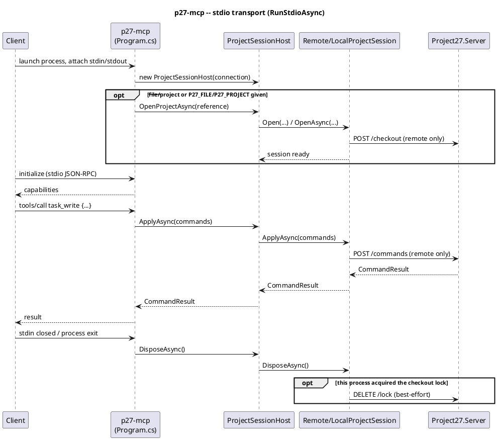
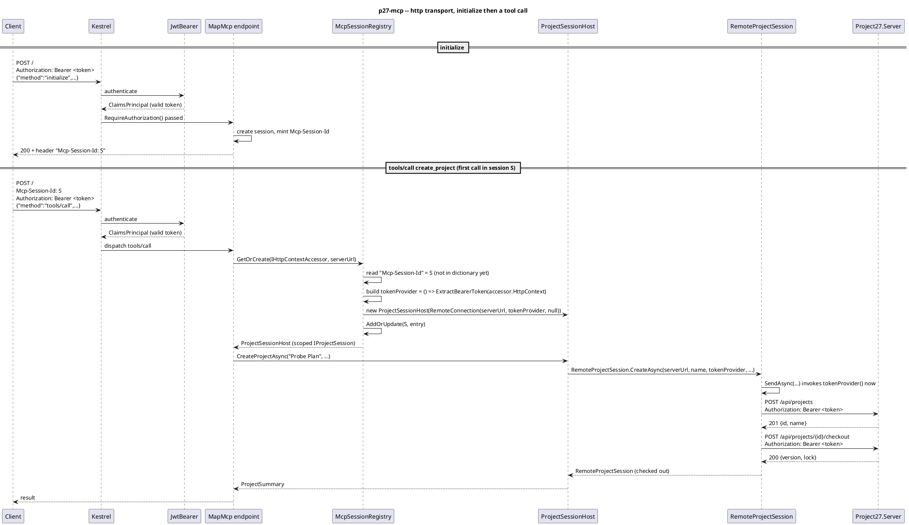
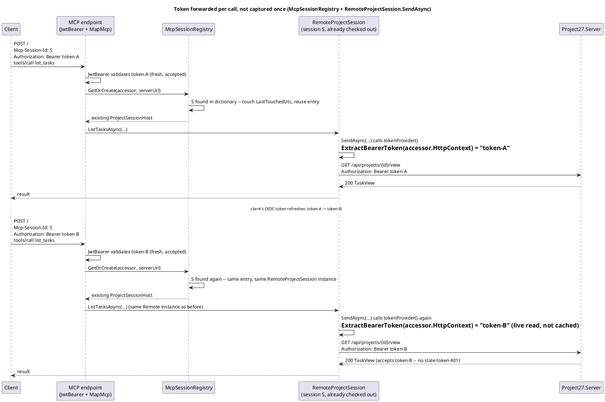
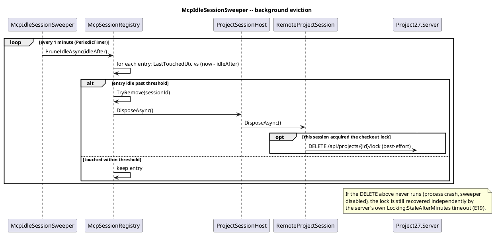

# MCP server epic

A third host, `src/Project27.Mcp` (binary `p27-mcp`), exposing Core's operations
as [Model Context Protocol](https://modelcontextprotocol.io/) tools so AI
clients (Claude Desktop, Claude Code, and any other MCP client) can plan and
inspect Project27 projects directly. Built on the official `ModelContextProtocol`
C# SDK. Two transports: stdio (default, one process per client) and HTTP
(`--transport http`, network-reachable, many concurrent clients).

## Mode selection (D8 parity)

Same dual-mode shape as the CLI (local `.p27` file vs. remote server), but the
project need not be resolved at launch: with no `--file`/`--project` given, the
session starts **idle** and `create_project`/`open_project` establish it lazily
on first use — every other tool fails with "no project open" until then. This
is what lets a chat client create or attach to a project mid-conversation.
Both are one-shot per session (still one project per process, D1) and reserve
their "slot" before doing file/HTTP work, so a failed create/open never leaves
an orphan file or half-open checkout behind.

HTTP mode has **no local-file mode and no dev-user fallback** — `--server`
(and its own bearer token, see below) is required up front, since a shared
HTTP endpoint can't have one fixed identity for every caller the way a
one-process-per-client stdio session can.

## Tools: grouped by entity, not 1:1 with commands

`ProjectCommand` has ~35 variants; instead of a 1:1 tool mapping (schema
overlap costs context tokens and hurts tool-selection accuracy), each tool
groups one entity's operations behind an `op` parameter — ~13 tools total
(session, reads like `list_tasks`/`get_usage`/`get_report`, writes like
`task_write`/`schedule_write`). Still a direct field-for-field mapping onto
the command records, just chosen by `op` instead of one tool per variant.

## Implementation gotchas for future tools

- The MCP SDK's reflection-based JSON-schema builder treats a parameter as
  **required** unless it has an explicit default — a nullable *type* alone
  (`string?`) isn't enough. `string? table` with no `= null` surfaces at call
  time as "missing a value for the required parameter", not a compile error.
  Every optional tool parameter needs an explicit default.
- The SDK swallows every tool exception to a generic "An error occurred"
  string — only `ModelContextProtocol.McpException`'s `Message` reaches the
  client. `Program.cs`'s `AddCallToolFilter` rethrows this codebase's
  user-facing exception types (`ProjectSessionException`, `ArgumentException`,
  `KeyNotFoundException`, `Commands.CommandException`) as `McpException`. New
  tool code should throw one of those (or extend the filter) for anything the
  model should be able to read and act on.

## Not in scope (v1)

Interop (MSPDI/CSV) isn't exposed as a tool. Use the CLI or web, then
`open_project` the result.

## HTTP transport

`RunHttpAsync`/`RunStdioAsync` in `Program.cs` are separate code paths, not a
shared one branched at the edges — the two modes' session model genuinely
differs, not just the wire format.

- **Auth is per-request, not per-process.** Every request needs a valid JWT
  bearer (`Auth:Authority`/`Auth:Audience`) validated by ASP.NET Core's
  JwtBearer middleware, the same OIDC provider `Project27.Server` trusts.
  Each session extracts *its own* caller's token from the `Authorization`
  header and forwards that same token downstream to Project27.Server — no
  credential mapping or token exchange.
- **Sessions are keyed by `Mcp-Session-Id`, not DI scope.** `Session/McpSessionRegistry.cs`
  is a singleton dictionary keyed by the Streamable HTTP transport's session
  header, deliberately not relying on ASP.NET's per-request DI scope — the SDK
  gives no guarantee a `Scoped` registration resolves to the same instance
  across the multiple independent POSTs one MCP session spans. Verified
  empirically, not just read about (see `McpSessionRegistryTests`).
- **The forwarded bearer token is read live, not captured once.** `McpSessionRegistry.GetOrCreate`
  hands `RemoteConnection` a closure over the live `IHttpContextAccessor`,
  invoked fresh on every outbound call — so a token refresh mid-session is
  forwarded on the very next call, not stale from session creation.
- **`McpIdleSessionSweeper`** (a `BackgroundService`) evicts sessions untouched
  for `Mcp:SessionIdleMinutes` (default 30) so a client that disconnects
  without a clean shutdown doesn't leak an open checkout + `HttpClient`
  forever — the transport gives no "session closed" hook. The server-side
  checkout lock itself still recovers independently via
  `Locking:StaleAfterMinutes` either way.

### Helm

`mcp-deployment.yaml`/`mcp-service.yaml`: ClusterIP Service, `/healthz`
probes. `Auth__Authority`/`Auth__Audience` come from the chart's existing
`auth.*` values — no devAuth equivalent for MCP (`devAuth.enabled` has no
effect on it). `mcp.pathPrefix` (empty = served at `/`) sets `Mcp__PathPrefix`
→ `MapMcp(prefix)`, for a proxy that addresses the Service by a fixed path
suffix rather than through the chart's own host-based routing.

## OAuth discovery

`Auth:Resource` (Helm: `mcp.resourceUrl`) makes remote MCP clients (Claude
Desktop, Claude Code, claude.ai) able to log in interactively instead of
requiring an operator to mint a bearer token by hand (`p27 login` +
`claude mcp add --header "Authorization: Bearer <token>"`, which still works
and remains the fallback when `Auth:Resource` is unset). Implemented via
`ModelContextProtocol.AspNetCore`'s built-in `AddMcp`/`McpAuthenticationHandler`
(RFC 9728 protected-resource metadata), not hand-rolled.

**Gotchas:**

- **Two audiences, both must validate, on both hops.** The metadata's
  `resource` field must equal this MCP server's own URL exactly (Claude
  checks this) — it can't just equal the existing `Auth:Audience`. But the
  authorization server mints the token's `aud` to match whatever `resource`
  the client requested, so a Claude-obtained token carries `aud=Auth:Resource`
  while a `p27 login`/web-SPA token carries `aud=Auth:Audience`. Since the
  same bearer token is forwarded downstream unchanged, **both** values must
  validate on **both** the MCP endpoint and `Project27.Server`. Neither uses
  the single-value `JwtBearerOptions.Audience` shorthand anymore for this
  reason — `McpResourceMetadataFactory.ValidAudiences` builds
  `{Audience, Resource}` for the MCP side; the Helm chart injects
  `Auth__AdditionalAudiences__0=mcp.resourceUrl` into the *server* Deployment
  for the other.
- **404s behind a TLS-terminating proxy unless corrected.** The SDK's
  metadata endpoint does a strict string match of the *incoming request's*
  scheme/host against `Auth:Resource` (`McpAuthenticationHandler.IsConfiguredEndpointRequest`).
  This chart's routing always terminates TLS externally, so Kestrel sees
  `http` while `Auth:Resource` says `https`. `RunHttpAsync` adds
  `UseForwardedHeaders` (with `KnownIPNetworks`/`KnownProxies` cleared — this
  process is only reachable via ClusterIP from trusted in-cluster hops)
  before `UseAuthentication()` to fix this.
- **Path prefixes need the metadata URI set explicitly.** `options.ResourceMetadataUri`
  is computed from the configured `Auth:Resource` (`McpResourceMetadataFactory.ResourceMetadataUri`),
  not inferred from the request — behind `mcp.pathPrefix`'s proxy, the
  request Kestrel sees isn't reliably the externally-visible address.
- **No Dynamic Client Registration**, here or on several other providers —
  but Claude Desktop/Code/claude.ai all accept a manually-supplied
  `client_id` as a fallback, so no DCR broker is needed. `mcp.clientId`
  defaults to the p27 CLI's own Entra app registration
  (`CliConfig.CliClientId`) so one registration covers both; its redirect
  URIs must additionally include Claude's callbacks:
  - Hosted (web/Desktop/mobile/Cowork): `https://claude.ai/api/mcp/auth_callback`
  - Claude Code: loopback on an ephemeral port — register bare `http://localhost`
    (no port) under Entra's "Mobile and desktop applications" platform, which
    matches any port. (Not the CLI's own fixed `http://127.0.0.1:64703/callback`
    — a different, also-registered URI for a different client.)
- **Entra also needs the resource registered as an Application ID URI**
  (`identifierUris`) on the app the API is exposed through, or the token
  request fails with `AADSTS9010010`. Requires the resource's domain to be a
  verified custom domain on the tenant — an Entra admin-portal step this
  chart can't do for you. `mcp.resourceUrl` defaults to empty (OAuth
  discovery off) since the real address is environment-specific and set from
  wherever this chart is actually deployed.

## Sequence diagrams

PlantUML, kept alongside the design they illustrate — each names the actual
classes/methods involved so it stays checkable against the code.

#### stdio: launch, tool call, shutdown

#### HTTP: session bootstrap and a tool call

Every request re-authenticates (JWT bearer); the session is looked up by
`Mcp-Session-Id`, not trusted to DI scope.

#### Token forwarded per call, not captured once

#### Idle session eviction

## Verification

Both transports, and both eager/lazy startup, were exercised live with a
hand-rolled JSON-RPC/stdio client, not just unit tests: local + remote
create/list/write round-trips cross-checked against the CLI reading the same
file/server, and idle-start → `create_project` → rejected second
`create_project` (no orphan file/checkout) for both modes.

`Project27.Mcp.Tests` covers `LocalProjectSession`, `ProjectSessionHost`
(including the create/open guards), the tool classes, and
`McpResourceMetadataFactory` (18+ tests). `RemoteProjectSession` has no
automated test yet — the live-server smoke tests above are its only coverage.
