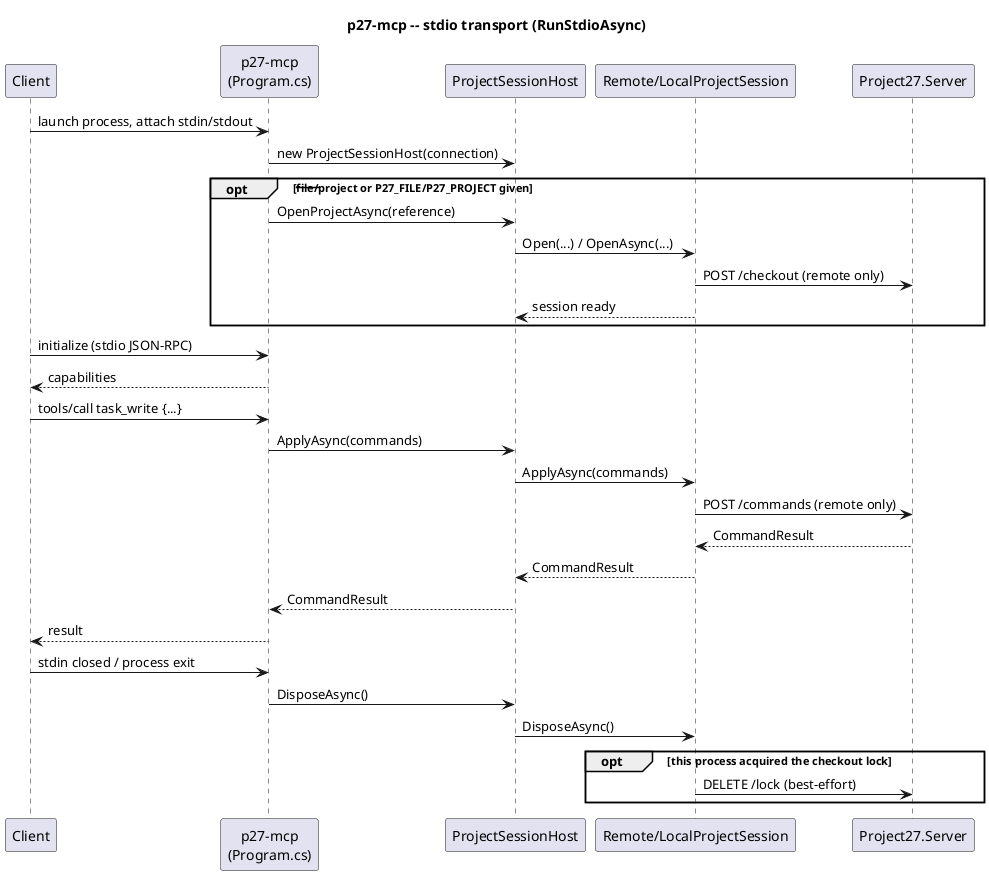
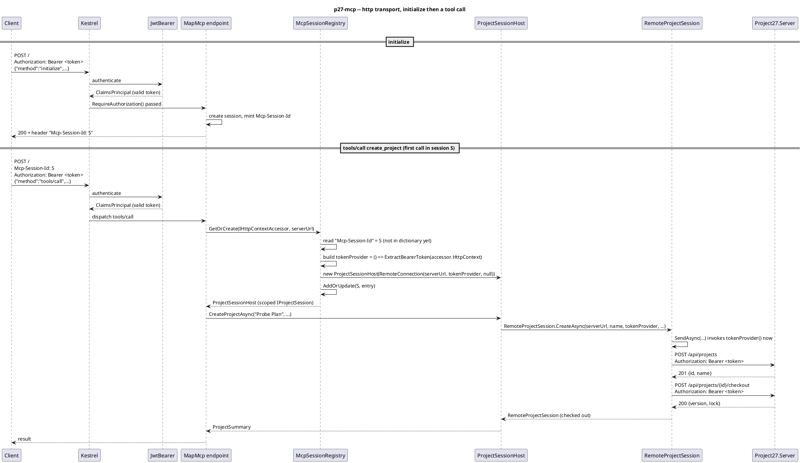
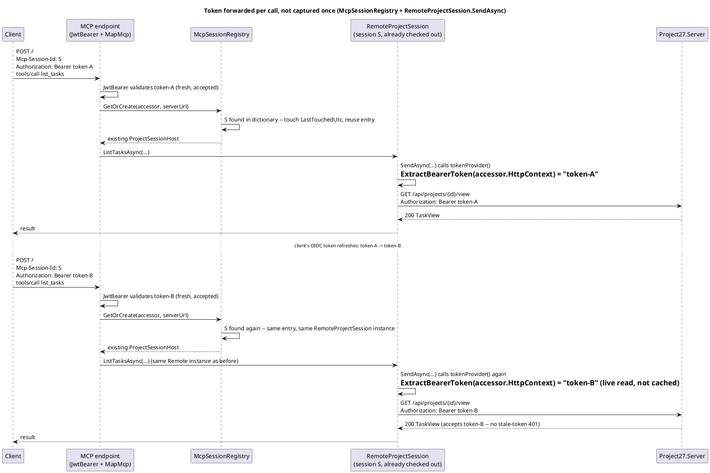
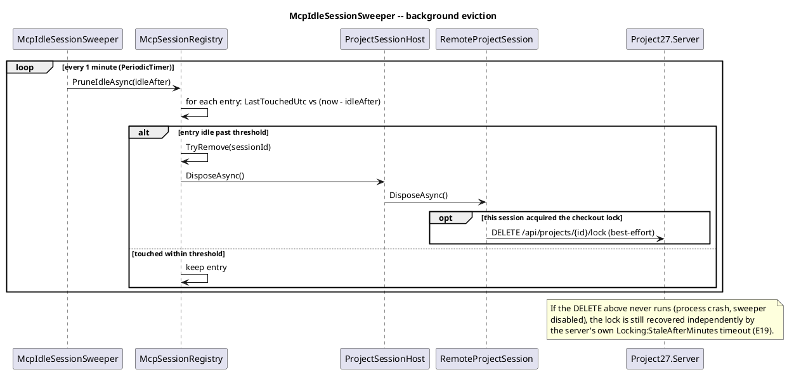

# MCP server epic

A third host, `src/Project27.Mcp` (binary `p27-mcp`), exposing Core's operations
as [Model Context Protocol](https://modelcontextprotocol.io/) tools so AI
clients (Claude Desktop, Claude Code, and any other MCP client) can plan and
inspect Project27 projects directly. Built on the official `ModelContextProtocol`
C# SDK, stdio transport only (the standard for a locally-launched MCP server).

## Mode selection (D8 parity)

Same dual-mode shape as the CLI — the server operates on exactly one project
for the life of its stdio session, but unlike the CLI that project need not
be resolved at launch:

- **Local**: `--file <path>` or `P27_FILE`; if neither is given, the sole
  `.p27` file in the current directory (same rule as `CliContext.ResolveFile`).
  If none of those resolve a file, the session starts idle in that directory.
- **Remote**: `--server <url>` or `P27_SERVER` (plus auth: `--dev-user`/
  `P27_DEV_USER` or `--token`/`P27_TOKEN`) is required up front, but
  `--project <name|id>`/`P27_PROJECT` is optional — without it the session
  starts idle against that server/credentials.

An idle session has no bound project yet; every tool except `create_project`/
`open_project` fails with a clear "no project open" error until one of those
establishes it (see below). This is what lets a chat client create or attach
to a project mid-conversation instead of needing the file/project chosen
before the server ever launches.

## `create_project` / `open_project`: establishing the session lazily

`Session/ProjectSessionHost` is the `IProjectSession` the tool classes
actually see. It forwards every read/write to whichever session is
"current," and adds two operations that aren't part of `IProjectSession`
itself:

- **`create_project`** — local mode: bootstraps a new `.p27` file via
  `LocalProjectSession.Create` (`path` defaults to `"<name>.p27"` in the
  server's working directory). Remote mode: `RemoteProjectSession.CreateAsync`
  POSTs `/api/projects` then checks it out, mirroring the server's own
  `CreateProject` handler.
- **`open_project`** — attaches to something that already exists: a `.p27`
  path (local) or a project name/id (remote, via the existing `Resolve` +
  checkout flow already used by eager startup).

Both are one-shot: the host reserves its "project slot" *before* doing any
file/HTTP work and releases the reservation if that work throws, so a
rejected or failed create/open never leaves an orphan file or a half-open
remote checkout behind. Calling either a second time — including a startup
that already resolved a file/project — fails fast with "a project is already
open in this session; restart the MCP server to work with a different one."
This isn't full multi-project support (still one project per process,
matching D1's per-invocation-scope simplicity); it only moves *when* that one
project gets chosen from "always at launch" to "at launch, or on first use."

Known asymmetry, accepted rather than fixed: remote `create_project` is two
server calls (`POST /api/projects` then checkout); if the first succeeds and
the second throws, the new project exists on the server but this session
never adopts it — a real orphan, the server-side counterpart of the local
orphan-file bug the slot-reservation guard fixes. Left as-is because the
window is a single network call on a project this session just created and
owns (checkout essentially always succeeds); revisit with a `DELETE
/api/projects/{id}` in the catch if it's ever observed in practice.

## `Session/IProjectSession`: the mode-agnostic seam

Tool classes depend only on `IProjectSession`; they don't know which mode is
active.

- **`LocalProjectSession`** opens the file via `Storage.SqliteProjectStore`,
  loads and recalculates once, and applies every mutation through Core's
  existing `Commands.CommandExecutor` — the same command layer the web
  client's `POST /commands` rides on (E20). No new mutation path.
- **`RemoteProjectSession`** checks the project out on open (D6), applies
  mutations via `POST /projects/{id}/commands`, and reads via the existing
  `GET .../schedule|view|usage|drivers/{uid}|reports/{name}` endpoints. The
  lock releases on dispose only if this session's checkout call was the one
  that acquired it — `AcquiredAt == RefreshedAt` on the checkout response
  means it was free before this call (mirrors the CLI's inferred-keep rule,
  E19). A best-effort unlock swallows failures on shutdown; `p27 unlock`
  recovers a stuck lock same as it does for the CLI.

Both implementations recalculate once after load and once per applied command
batch, matching every other host (E2) — nothing auto-recalculates.

## Wire shapes: a third consumer-owned projection

`Session/ProjectionDtos.cs` defines Mcp's own read-side records (`TaskView`,
`UsageResult`, `ProjectSummary`, ...). This is not a new design — it's the
same "projections are consumer-owned" split as CLI `JsonShapes` and server
`ScheduleProjection` (E22), just a third consumer. `LocalProjectSession`
builds these directly from Core (`Views.TaskView`, `Reports.ReportBuilder`,
`EarnedValue`, `ProjectStats`, `Usage.Timephased`, `Scheduling.TaskDrivers`);
`RemoteProjectSession` deserializes the server's JSON straight into the same
record shapes (field names were chosen to match the server DTOs exactly, so
no translation layer is needed on that side).

Writes skip the parallel-model problem entirely: tool methods construct the
actual `Core.Commands.ProjectCommand` subtypes (`AddTaskCommand`,
`SetResourceCommand`, ...) from their flattened parameters and hand them to
`IProjectSession.ApplyAsync`, which either runs them through
`CommandExecutor` in-process (local) or serializes the same polymorphic
`ProjectCommand` list straight into the commands POST body (remote) — the
`[JsonPolymorphic]`/`[JsonDerivedType]` attributes on `ProjectCommand` (E20)
mean no bespoke serialization code is needed for either path.

## Tools: grouped by entity, not 1:1 with commands

`ProjectCommand` has ~35 variants; a 1:1 tool-per-command mapping would mean
~35 top-level tools with heavy schema overlap (many MCP clients pay a
context-token cost per tool definition on every turn, whether called or
not, and more same-shaped tools measurably hurts a model's tool-selection
accuracy). Instead, each tool groups one entity's operations behind an `op`
parameter, giving ~13 tools total:

- **Session**: `create_project`, `open_project`
- **Reads**: `get_project`, `list_tasks`, `get_task`, `list_resources`,
  `get_task_drivers`, `get_usage`, `get_report`
- **Writes**: `task_write`, `link_write`, `resource_write`,
  `assignment_write`, `calendar_write`, `field_write`, `schedule_write`
  (baselines/leveling/reschedule), `project_write`

Each write tool's parameters are a flattened union of the fields its grouped
commands need (e.g. `task_write` covers add/set/remove/move/indent/outdent/
split/unsplit/addRecurring) — still a direct field-for-field mapping onto the
command records, just chosen by an `op` string instead of one tool per
variant. `list_tasks`/`get_task` reuse the engine's existing filter/sort/
field-key syntax (`Views.FilterParser`, `Views.TaskView.Tables`) rather than
inventing a second query language.

## Implementation gotchas for future tools

- The MCP C# SDK's reflection-based JSON-schema builder treats a parameter as
  **required** unless it has an explicit default (`= null`, `= false`, ...) —
  a nullable *type* alone (`string?`) is not sufficient. A parameter declared
  `string? table` (no `= null`) surfaces at call time as "the arguments
  dictionary is missing a value for the required parameter", not a compile
  error. Every optional tool parameter in this codebase carries an explicit
  default; keep that pattern for any new tool.
- By default the SDK swallows every tool exception to a generic "An error
  occurred invoking '<tool>'" string — only `ModelContextProtocol.McpException`'s
  `Message` reaches the client (its doc comment says as much: other exception
  types are assumed to risk leaking internals). `Program.cs` registers a
  `WithRequestFilters(f => f.AddCallToolFilter(...))` that catches this
  codebase's user-facing exception types (`ProjectSessionException`,
  `ArgumentException`, `KeyNotFoundException`, `Commands.CommandException`)
  and rethrows them as `McpException` so the model actually sees "no task
  with uid 47" instead of a content-free failure. New tool code should throw
  one of those types (or extend the filter's exception list) for anything
  the model should be able to read and act on.

## Not in scope (v1)

Interop (MSPDI/CSV import/export) isn't exposed as a tool — `create_project`/
`open_project` cover starting or attaching to a `.p27`/server project, but
not importing one from another format. Use the CLI or web for that, then
`open_project` the result.

## Verification

Both modes, and both the eager and lazy startup paths, were exercised live
with a hand-rolled JSON-RPC/stdio client, not just unit tests:

- **Local, pre-existing file**: `initialize` → `tools/list` → `get_project` →
  `list_tasks` → `task_write` add against a real example `.p27` file, then the
  same file reopened with `p27 task list --json` — confirmed the CLI saw the
  task the MCP server added.
- **Remote, pre-existing project**: the same sequence plus
  `get_task_drivers`, `get_usage`, and `get_report`, against a throwaway
  project on a real `Project27.Server` (DevAuth, localhost) — every
  read/write round-tripped through checkout, `POST /commands`, and the
  view/schedule/usage/drivers/reports endpoints, and `p27 task list` against
  the same server confirmed the write persisted.
- **Local and remote, launched idle**: launched with no `--file`/`--project`,
  confirmed `get_project` fails with the actual "no project open" message
  (not the SDK's generic one), then `create_project` → `task_write` →
  a second `create_project` call (confirmed rejected, with no orphan file on
  disk and no orphan checkout) — for both local (`p27-mcp` with no args in an
  empty directory) and remote (`p27-mcp --server ... --dev-user ...` with no
  `--project`), each cross-checked via the CLI against the same file/server.

`Project27.Mcp.Tests` covers `LocalProjectSession`, `ProjectSessionHost`
(including the create/open guards and the no-orphan-file regression), and
the tool classes directly (18 tests). `RemoteProjectSession` has no
automated test yet — the live-server smoke tests above are its only
coverage today. Not done: an in-process integration test against a running
`Project27.Server` fixture; the CLI/Server test projects'
`WebApplicationFactory` harness is the natural base for a follow-up.

## HTTP transport (2026-07-19)

`--transport http` / `P27_MCP_TRANSPORT=http` runs `p27-mcp` as a network-reachable
ASP.NET Core service (`ModelContextProtocol.AspNetCore`'s `WithHttpTransport()` +
`MapMcp()`) instead of the stdio transport described above, which stays the default
and is otherwise unchanged — `RunStdioAsync`/`RunHttpAsync` in `Program.cs` are
separate code paths, not a shared one branched at the edges, because the two modes'
session model genuinely differs rather than just their wire format.

### Why auth changes, not just the wire format

Stdio's trust is implicit: the client launches the process itself, so whoever holds
`P27_TOKEN`/`--dev-user` is, by construction, the only party who can talk to it, and
one process serves exactly one client for its whole lifetime. Neither holds once the
same binary is a shared HTTP endpoint:

- **A new client→MCP leg needs its own authentication.** The HTTP endpoint requires
  a valid JWT bearer token on every request (`Auth:Authority`/`Auth:Audience`,
  `Microsoft.AspNetCore.Authentication.JwtBearer` — the *same* OIDC provider
  `Project27.Server`'s `AuthSetup` trusts), enforced with ASP.NET Core
  authentication/authorization middleware plus `.RequireAuthorization()` on the
  mapped MCP endpoint. `/healthz` stays anonymous for k8s probes.
- **The MCP→server leg's credential can no longer be one static value for the whole
  process.** Over stdio, a single `P27_TOKEN`/`P27_DEV_USER` for the process's whole
  lifetime is fine because there's only ever one caller. Over HTTP, that would mean
  every caller of the shared endpoint acts as the same backend identity — a
  privilege-escalation vector, not a convenience. Instead, each session extracts
  *its own* caller's bearer token from the `Authorization` header and forwards that
  same token to the Project27 server (`RemoteConnection(serverUrl, tokenProvider,
  DevUser: null)`) — one token validated independently by both hops, no separate
  credential mapping or token exchange needed. Consequently HTTP mode has no
  local-file mode and no dev-user fallback: both only make sense for a single fixed
  identity.

### Why sessions are per-connection, not per-process

`--transport http` deliberately does *not* keep `ProjectSessionHost` a singleton the
way stdio does. An HTTP endpoint is one process serving arbitrarily many concurrent
callers; a singleton would mean every caller shares one project, one checkout lock,
and — worse, given the point above — one bearer token. So each MCP session gets its
own `ProjectSessionHost`, starting idle (`create_project`/`open_project` establish it
lazily, exactly the mechanism already built for "a chat client with nothing to point
at yet" — HTTP mode just always takes that path, never resolving a project eagerly).

The plumbing is `Session/McpSessionRegistry.cs`, a singleton keyed by the Streamable
HTTP transport's `Mcp-Session-Id` header, which the transport sends on every request
once a session is established (confirmed via `ModelContextProtocol.AspNetCore`'s
`StreamableHttpHandler.McpSessionIdHeaderName`). This is deliberately *not* relying
on ASP.NET Core's per-request DI scope, nor on any implicit "DI scope per MCP
session": the SDK's docs give no guarantee that a `Scoped` registration resolves to
the same instance across the multiple independent HTTP requests one long-lived MCP
session spans (each JSON-RPC call is its own POST) — this was checked empirically,
not just read about, with a throwaway probe reproducing this exact registration
shape: `initialize` → three separate `tools/call` POSTs sharing one `Mcp-Session-Id`
resolved the *same* `ProjectSessionHost` instance each time (a project created on
call 1 was visible, via a real `get_project`, on call 3), `IHttpContextAccessor`
returned the live per-call request from inside the factory every time, and a second,
independent session id resolved to a distinct, empty host. So a session-keyed
registry is confirmed necessary and confirmed sufficient — not merely the safer
guess between two unverified options.

A session's `ProjectSessionHost` (and its `ProjectId`/checkout lock) is established
once, on that session's first tool call — but the bearer token forwarded downstream
is **not** captured at that point. `McpSessionRegistry.GetOrCreate` hands
`RemoteConnection` a `Func<string?>` closure over the live `IHttpContextAccessor`
(`() => ExtractBearerToken(httpContextAccessor.HttpContext)`), and
`RemoteProjectSession`'s `SendAsync` invokes it fresh before *every* outbound call,
not once at `HttpClient` construction (previously `BuildClient` set a fixed
`DefaultRequestHeaders.Authorization` from whatever token was passed in). So a token
refresh mid-session is forwarded on the very next call, from whichever HTTP request
happens to carry it — there's no divergence between what the *inbound* MCP request
accepts and what the *outbound* Project27.Server call presents, because both read
the same live header. stdio is unaffected: its token is a fixed `--token`/`P27_TOKEN`
for the process's whole lifetime, wrapped in a constant closure (`() => token`), so
invoking it "fresh" every call returns the same value it always did.

Verified with `McpSessionRegistryTests.ExtractBearerToken_reads_the_live_header_not_a_snapshot`:
mutating the accessor's `HttpContext` between two calls changes what the extractor
returns, which is the one property the fix depends on — `SendAsync` and the closure
that wraps `ExtractBearerToken` are both simple enough to verify correct by
inspection once that property holds.

The transport exposes no "session closed" hook to application code, so nothing marks
an entry for removal when a client disconnects cleanly — left unbounded, this would
leak an open checkout *and* a live `HttpClient` per abandoned session in a
long-running shared process. `McpIdleSessionSweeper` (a `BackgroundService`, wired in
`RunHttpAsync`) sweeps the registry every minute and disposes anything untouched for
longer than `Mcp:SessionIdleMinutes` (default 30, matching `Locking:StaleAfterMinutes`
in spirit though it's a separate setting). An evicted entry's still-open server-side
checkout lock is then recovered the same way any other abandoned checkout already
is — `Locking:StaleAfterMinutes` (E19) — the sweeper just stops the registry itself
from growing without bound; it isn't what reclaims the lock.

### Helm

`charts/project27/templates/mcp-deployment.yaml` + `mcp-service.yaml`: a ClusterIP
Service and `/healthz` startup/liveness/readiness probes (`mcp.probes`, same shape as
`server.probes`), since the deployment is now actually reachable rather than an
exec-only image placeholder. `Auth__Authority`/`Auth__Audience` come from the chart's
existing top-level `auth.*` values (the same OIDC provider the server uses);
`mcp.enabled=true` requires `auth.authority` and fails fast otherwise, mirroring the
server's own required-value check — devAuth has no equivalent for MCP, so
`devAuth.enabled` doesn't affect it either way.

### Sequence diagrams

PlantUML, kept alongside the design they illustrate. Each one names the actual
classes/methods involved so it stays checkable against the code, not just the prose
above.

#### stdio: launch, tool call, shutdown

One process, one session, established synchronously before the JSON-RPC loop starts
(`RunStdioAsync`). Unaffected by any of the HTTP-mode work below.

#### HTTP: session bootstrap and a tool call

Every request re-authenticates (JWT bearer); the session itself is looked up by the
`Mcp-Session-Id` header, not trusted to DI scope (see "Why sessions are per-connection"
above — this is the mechanism that was verified empirically).

#### Token-refresh fix: same session, caller's token changes mid-session

The interaction the fix is actually about. Before the fix, `tokenProvider` was a
value captured once at session creation; after it, it is a closure re-evaluated on
every outbound call, so call 2 forwards the caller's *new* token instead of the one
captured on call 1.

#### Idle session eviction

Runs independently of any client traffic; recovers memory/sockets in the MCP process
itself. The server-side checkout lock's own recovery (`Locking:StaleAfterMinutes`,
E19) is separate and unconditional — it doesn't depend on the sweeper running.

